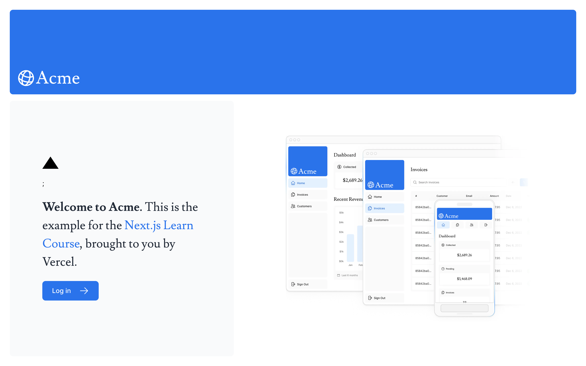
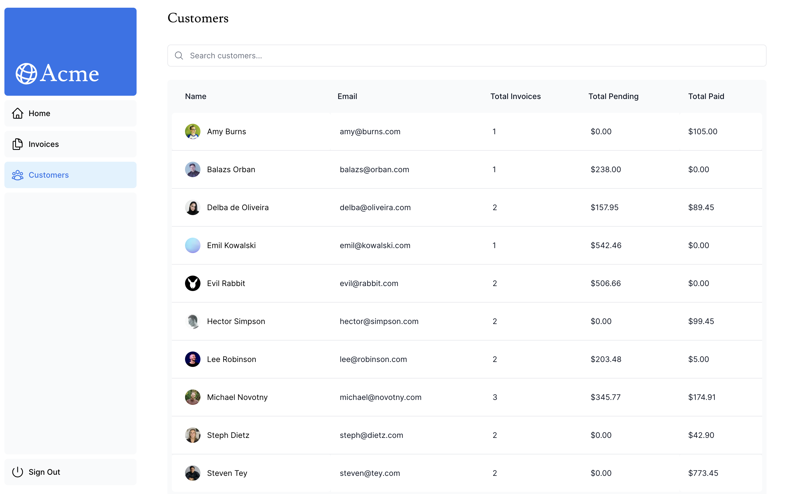
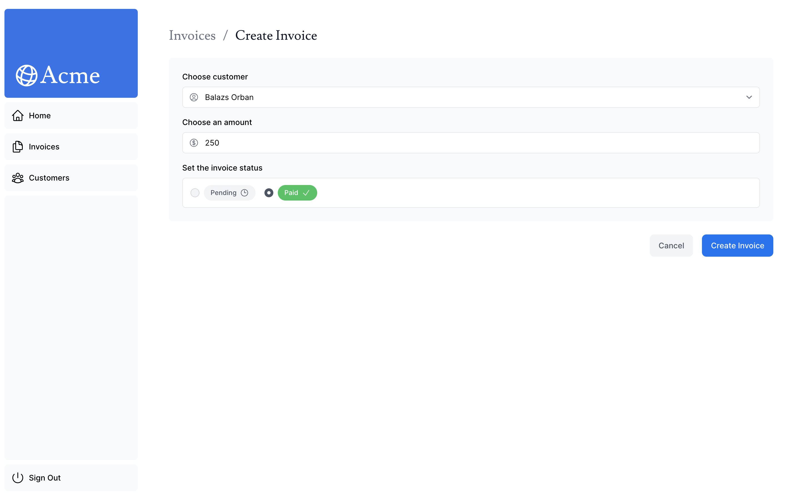
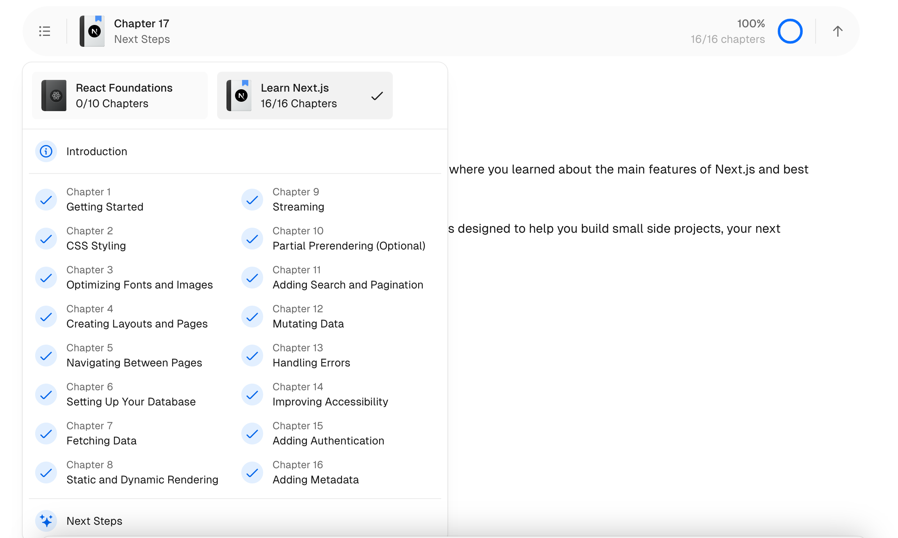

## Next.js App Router Course - Starter

The official Next.js Course Dashboard, built with App Router

Learning from beginner to expert by crafting the foundations of Next.js and building a fully functional demo website that uses all the latest features.

For more information, see the [course curriculum](https://nextjs.org/learn) on the Next.js Website.

Login credentials :
- Email: user@nextmail.com
- Password: 123456
