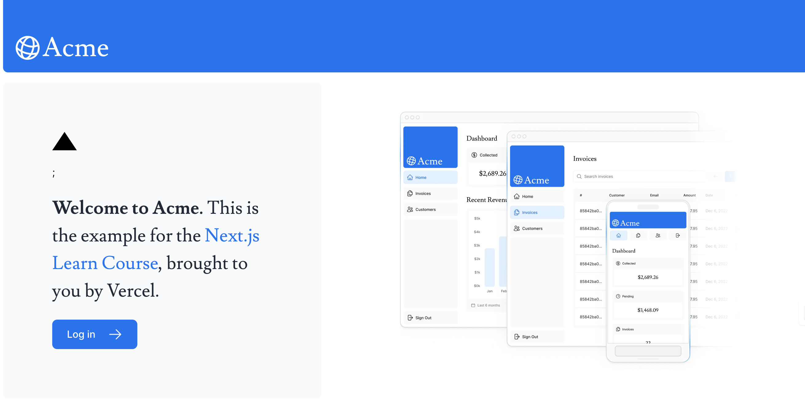
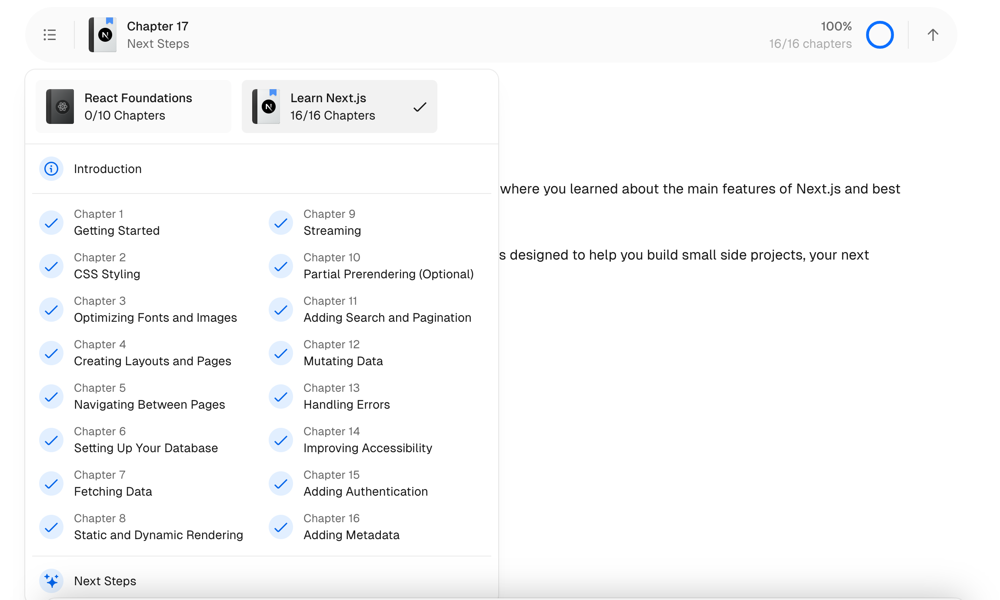

## Next.js App Router Course - Starter

This is the starter template for the Next.js App Router Course. It contains the starting code for the dashboard application.

Start building with Next.js - Tutorials from Next JS Docs : Go from beginner to expert by learning the foundations of Next.js and building a fully functional demo website that uses all the latest features.

For more information, see the [course curriculum](https://nextjs.org/learn) on the Next.js Website.
